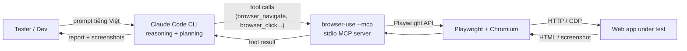

# agent-tester

MVP demo: dùng **Claude Code CLI** + **Browser Use MCP** để AI tự điều khiển browser thực hiện test web app — không cần API key thứ 2, không cần cloud.

## Kiến trúc



| Layer | Trách nhiệm |
|---|---|
| Claude Code | Hiểu yêu cầu, lập kế hoạch test, đánh giá pass/fail |
| browser-use MCP | Expose ~30 raw browser primitives (navigate, click, type, screenshot, state, extract...) qua stdio |
| Playwright + Chromium | Thực thi thao tác browser thật |

**Tại sao stack này**
- Claude Code lo reasoning → không cần thêm OpenAI/Anthropic key
- MCP expose **raw primitives** (không phải `run_agent` high-level) → Claude tự reason từng bước, dễ debug
- Local stdio → không cần cloud, không tốn phí session

## Quickstart

Yêu cầu: macOS, Python 3.11+, [Claude Code CLI](https://claude.com/claude-code).

```bash
git clone https://github.com/hkthao/agent-tester.git
cd agent-tester

python3 -m venv .venv
.venv/bin/pip install --upgrade pip
.venv/bin/pip install browser-use playwright
.venv/bin/playwright install chromium

claude
```

Trong Claude Code:

```
/mcp
```

Phải thấy `browser-use ✓ Connected`. Nếu chưa, xem [Troubleshooting](./scenarios/README.md#troubleshooting-nhanh).

Test thử:

```
Mở https://www.saucedemo.com và cho tôi tiêu đề trang
```

## Cấu trúc repo

```
agent-tester/
├── README.md              # bạn đang đọc
├── PLAN.md                # plan triển khai 4 phase, ~2 giờ
├── .mcp.json              # config MCP server (relative path tới .venv/)
└── scenarios/             # 3 kịch bản demo cho saucedemo.com
    ├── README.md          # kiến trúc + test users + troubleshooting
    ├── A-validation.md    # 4 case validation login
    ├── B-happy-path.md    # luồng mua hàng end-to-end
    └── C-bug-hunt.md      # AI tự tìm bug (wow factor)
```

## Tài liệu

- [PLAN.md](./PLAN.md) — kế hoạch 4 phase chi tiết (Prerequisites → Setup → Scenarios → Demo)
- [scenarios/README.md](./scenarios/README.md) — index 3 demo scenario + bảng test users + troubleshooting

## License

Xem [LICENSE](./LICENSE).
