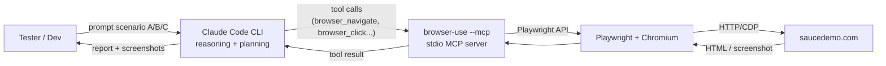

# Demo Scenarios — Saucedemo

Bộ 3 kịch bản test web tự động dùng **Claude Code CLI** + **Browser Use MCP**, target [saucedemo.com](https://www.saucedemo.com/).

## Kiến trúc



**Vai trò**

| Layer | Trách nhiệm |
|---|---|
| Claude Code | Hiểu yêu cầu tiếng Việt, lập kế hoạch test, gọi tool, đánh giá pass/fail |
| browser-use MCP | Expose ~30 raw browser primitives (navigate, click, type, screenshot, state, extract...) qua stdio |
| Playwright + Chromium | Thực thi thao tác browser thật |
| saucedemo.com | System under test — public demo site có sẵn user happy/buggy |

**Tại sao chọn stack này**

- Không cần API key thứ 2 — Claude Code lo reasoning, MCP chỉ là tay chân
- Tools là **raw primitives** (không phải `run_agent` high-level) → Claude tự reason từng bước, dễ debug
- Local stdio → không cần network/cloud, không tốn phí session

## Prerequisites

- macOS (đã test trên Darwin 25.x)
- Python 3.11+ — kiểm tra `python3 --version`
- Claude Code CLI — kiểm tra `claude --version`
- Đã cài browser-use trong venv: `agent-tester/.venv/bin/browser-use`
- Đã cài Chromium: `playwright install chromium`
- Đã có file `agent-tester/.mcp.json` trỏ tới venv binary

Setup chi tiết xem [PLAN.md](../PLAN.md) (Phase 0 + Phase 1).

## Test users của saucedemo

| Username | Hành vi | Dùng cho |
|---|---|---|
| `standard_user` | Hoạt động bình thường | Scenario A (case 4), B |
| `locked_out_user` | Bị khóa, login fail | Scenario A (case 3) |
| `problem_user` | UI bug cố ý (ảnh sai, sort lỗi, button lỗi) | **Scenario C** |
| `performance_glitch_user` | Chậm bất thường | Test performance (optional) |
| `visual_user` | Lỗi CSS / visual | Alternative cho C |
| `error_user` | Lỗi random ở các action | Stretch goal |

> Password chung: `secret_sauce`

## Scenarios

| # | File | Mục tiêu | Thời gian | Wow factor |
|---|---|---|---|---|
| A | [A-validation.md](./A-validation.md) | Test 4 case validation login | ~2 phút | Warmup |
| B | [B-happy-path.md](./B-happy-path.md) | Luồng mua hàng end-to-end | ~3 phút | Thay thế click thủ công |
| C | [C-bug-hunt.md](./C-bug-hunt.md) | AI tự tìm bug (không brief) | ~3 phút | **Cao nhất** |

Thứ tự demo đề xuất: **A → B → C** (đi từ kiểm soát → tự do).

## Cách chạy

```bash
cd /Users/kimthaohuynh/workspace/mvp/agent-tester
claude
```

Trong Claude Code:

1. Gõ `/mcp` — verify `browser-use` xuất hiện và status `Connected`
2. Mở file scenario tương ứng (vd. `scenarios/A-validation.md`), copy block prompt
3. Paste vào Claude Code, Enter
4. Theo dõi Chromium mở ra, thao tác từng bước
5. Đọc report Claude trả về cuối session

## Troubleshooting nhanh

| Triệu chứng | Nguyên nhân thường gặp | Fix |
|---|---|---|
| `/mcp` không thấy `browser-use` | Chạy `claude` ngoài thư mục `agent-tester/` | `cd` đúng folder rồi `claude` lại |
| `/mcp` không thấy + đã `cd` đúng | Lần đầu mở project, Claude Code cần "Trust" prompt | Thoát claude, mở lại, chọn Yes khi hỏi trust |
| Chromium không hiện UI | Chạy headless mode | Sửa `.mcp.json` thêm `"--headed"` vào `args` |
| Claude báo "no browser tool" | MCP server fail khi start | `tail ~/Library/Logs/Claude/mcp-server-browser-use.log` |
| `browser-use` not found | Venv path sai trong `.mcp.json` | Verify `ls .venv/bin/browser-use` |

## Sau buổi demo

Gợi ý câu hỏi để hỏi team tester:

- Thao tác QA nào bạn thường lặp lại nhiều nhất mỗi build? → ưu tiên tự động hoá
- Bug khó tìm nhất gần đây là gì? Có phải edge case không? → có thể giao Scenario C
- Nếu AI tự chạy regression mỗi đêm thì cần report format nào? → định hình output
